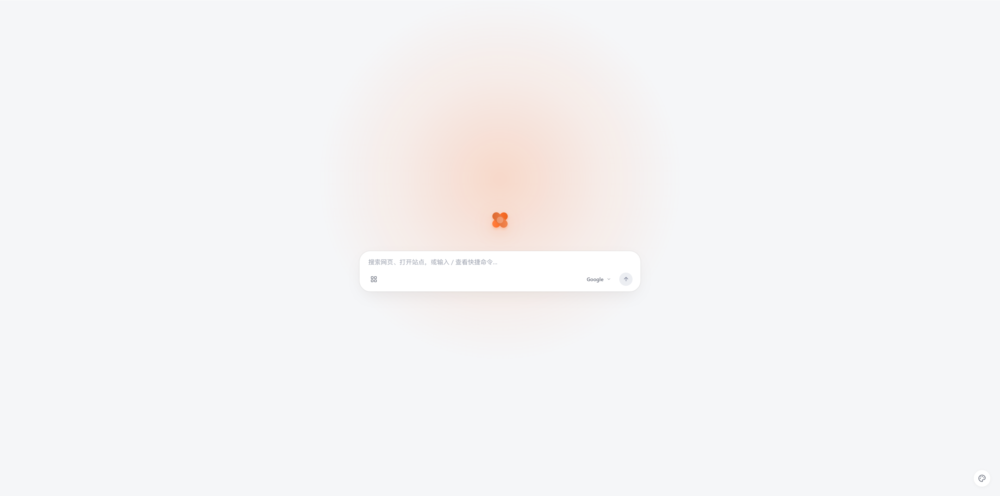

# Flow Tab - 极简流光新标签页

> 🍃 一个极简、优雅、高可定制的 Chrome / Chromium 新标签页扩展 (Manifest V3)



## ✨ 核心特性

- **🎯 专注与极简设计**：无广告、无信息流干扰，沉浸式搜索与启动体验。
- **🔍 多搜索引擎与自定义管理**：
  - 预设 Google、百度、必应、GitHub 常用引擎，支持快速切换。
  - 支持添加任意多个自定义搜索引擎（URL 模板如 `%s`）。
  - 支持搜索引擎列表**自由拖拽排序**、编辑与删除。
- **⚡ 斜杠快捷指令 (Command Palette)**：
  - 输入 `/` 快速唤起快捷指令面板（`/bili` 站内搜索、`/yt` YouTube 检索、`/trans` 谷歌翻译等）。
  - 选中指令自动带空格补全并聚焦末尾，告别空白跳转。
- **🍱 Bento 常用快捷站点**：
  - 支持任意添加个人高频访问站点。
  - **通用级联高清 Favicon 探针**：优先读取 Chrome 原生收藏夹图标，多级自动降级，绝不模糊。
  - **自定义图标能力**：卡片支持随时编辑（✎），支持指定自定义图片 URL 或输入专属 Emoji。
  - 支持 HTML5 原生**拖拽调序**并自动持久化。
- **🎨 个性化主题系统**：
  - 预设 5 款经典流光配色 + **专属大圆角无极调色板**，随心定制专属强调色。
  - 完善的暗黑模式与明亮模式无缝切换。
- **🔒 隐私优先与轻量**：纯原生前端实现，零外部臃肿依赖，全部偏好数据保存在本地 `chrome.storage.local`。

---

## 🚀 安装与使用

### 1. 下载或克隆仓库
```bash
git clone https://github.com/WanFengnie/flow-tab.git
```

### 2. 打开 Chrome 扩展管理页
在 Chrome / Edge 地址栏输入：
```text
chrome://extensions
```
或
```text
edge://extensions
```

### 3. 开启开发者模式并加载扩展
1. 在扩展管理页右上角打开 **“开发者模式” (Developer mode)**。
2. 点击左上角的 **“加载已解压的扩展程序” (Load unpacked)**。
3. 选择克隆或下载的本插件文件夹。

### 4. 开启全新流光体验
在浏览器中按下 `Ctrl + T` 打开一个新标签页即可！

---

## 🛠️ 技术栈
- Chrome Extensions **Manifest V3**
- 原生 HTML5 / CSS3（现代 CSS 变量、毛玻璃特效）
- 原生 Vanilla JavaScript (ESNext)
- 零第三方构建依赖，开箱即用

---

## 📄 License
MIT License
